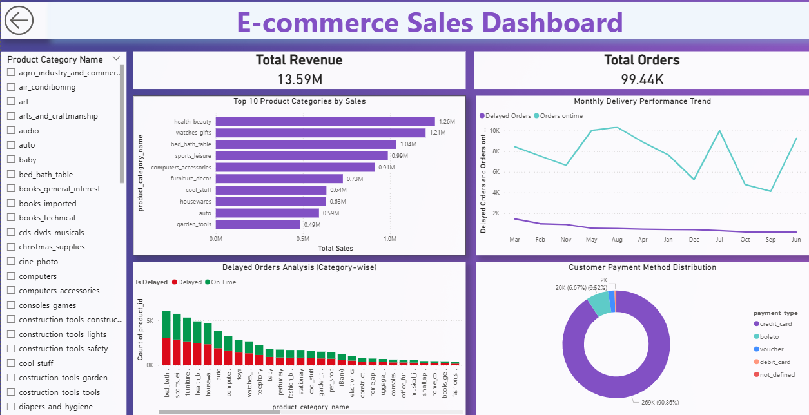
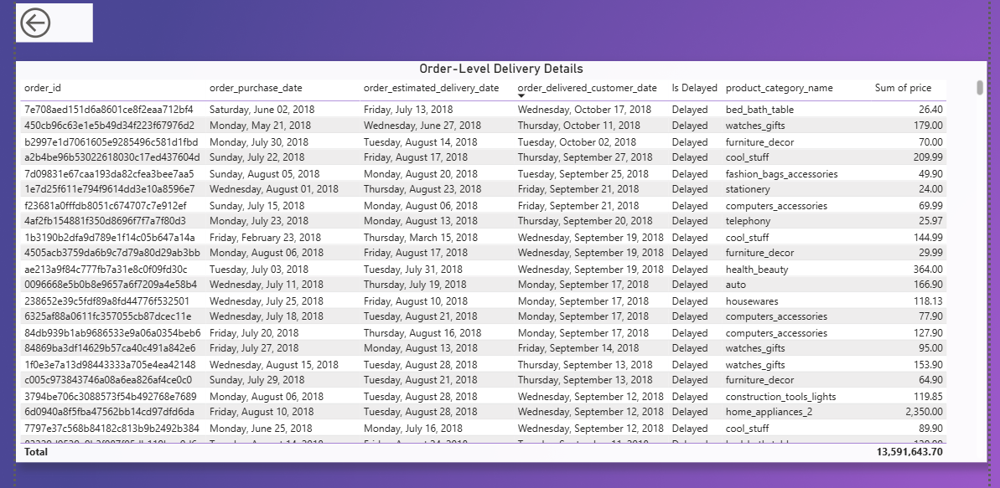
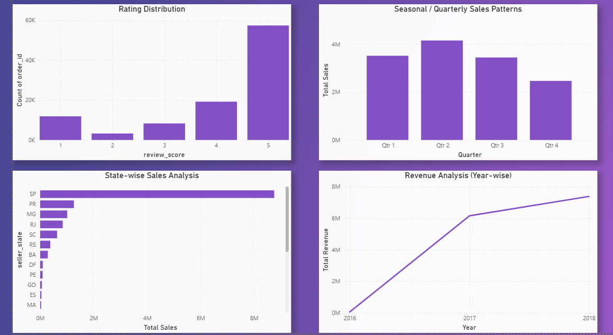

# 📊 E-commerce Business Intelligence Dashboard

---

## 🚀 Project Overview

**E-commerce Business Intelligence Dashboard** is an end-to-end Power BI analytics solution built to address a critical lack of visibility caused by fragmented, manual records across multiple operational domains such as logistics, customer reviews, payments, and sales.

The project delivers a **centralized BI system** that integrates **nine datasets into a single source of truth**, enabling automated and data-driven insights into revenue, delivery performance, customer behavior, and regional sales trends.

*Designed and delivered a Power BI dashboard to automate sales performance tracking and business intelligence reporting across complex, multi-source e-commerce data.*

---

## 🚀 Key Business Metrics
- **Total Revenue:** 13.59M  
- **Total Orders:** 99.44K  
- **Delivery Performance:** Delayed vs On-Time orders  
- **Customer Satisfaction:** Rating distribution  
- **Sales Trends:** Monthly, Quarterly & Year-wise

---

## 🖥️ Dashboard Screenshots

### 🔹 Dashboard Overview

  

**Insights Covered:**
- Top 10 product categories by sales  
- Monthly delivery performance trends  
- Delayed orders analysis (category-wise)  
- Customer payment method distribution  

---

### 🔹 Order-Level Delivery Details

  

**Insights Covered:**
- Order-wise delivery tracking  
- Estimated vs actual delivery dates  
- Delay identification at transaction level  
- Revenue contribution per order  

---

### 🔹 Trend & Performance Analysis

  

**Insights Covered:**
- Rating distribution analysis  
- Seasonal / quarterly sales patterns  
- State-wise sales performance  
- Revenue growth (year-wise)  

---

## 🛠️ Skills & Tools Used

- 📊 **Power BI**
- 📐 **DAX (Data Analysis Expressions)**
- 🧩 **Data Modeling (One-to-Many Relationships)**
- 🔄 **Power Query (Advanced Data Cleaning)**
- 📈 **Business Intelligence & KPI Design**

---

## 📂 Data Model

- Built a relational data model using **one-to-many relationships**
- **Orders** table used as the central fact table
- Supporting dimension tables:
  - Customers
  - Sellers
  - Products
  - Payments
  - Reviews
  - Logistics & Delivery datasets

---

## 📌 Dashboard Tasks & Analytical Objectives

### 1️⃣ Top Categories by Total Sales
- Visualized **Top 10 product categories** by total revenue
- Enabled rapid identification of high-performing categories

---

### 2️⃣ Delayed Orders Analysis
- Defined delayed orders as:
  > *Actual Delivery Date > Estimated Delivery Date*
- Analyzed delayed orders **category-wise**

---

### 3️⃣ Monthly Comparison of Delayed vs On-Time Orders
- Compared month-wise:
  - Delayed orders
  - On-time / early orders
- Implemented:
  - 🔍 Drill-through
  - 🔗 Cross-report interactions

---

### 4️⃣ Payment Method Analysis
- Identified most frequently used payment methods
- Visualized using:
  - Pie charts
  - Donut charts

---

### 5️⃣ Rating Distribution Analysis
- Identified:
  - ⭐ Analyzed customer satisfaction at the order level, as reviews were captured per order rather than per product.
  - ⚠️ Visualized the distribution of ratings to understand how customers rated their purchase experience overall.
- Represented using Clustered Column Chart

---

### 6️⃣ State-wise Sales Analysis
- Visualized sales performance across states
- Identified high- and low-performing regions

---

### 7️⃣ Seasonal & Quarterly Sales Trends
- Analyzed seasonal and quarterly sales patterns
- Identified demand fluctuations across the year

---

### 8️⃣ Revenue Analysis
- Calculated total revenue for ShopNest Store
- Analyzed year-wise revenue growth trends

---

## 📈 Key Outcomes

✔ Unified 9 datasets into a single BI model  
✔ Automated KPI and revenue tracking  
✔ Identified top-performing regions and payment methods  
✔ Enabled scalable, insight-driven decision-making  

---

## 👤 Author

**Arundas P R**  
📊 Data Analytics | Power BI | Python | Business Intelligence  

---

⭐ *If you find this project useful, feel free to star the repository!*

